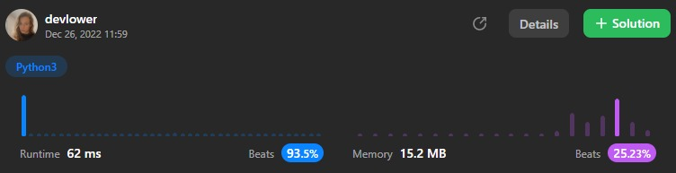

# 2 Sum

#### Given an array of integers `nums` and an integer `target`, return *indices of the two numbers such that they add up to* `target`.

#### You may assume that each input would have *exactly* one solution, and you may not use the *same* element twice.

#### You can return the answer in any order.

### Example 1:
```
Input: nums = [2,7,11,15], target = 9
Output: [0,1]
Explanation: Because nums[0] + nums[1] == 9, we return [0, 1].
```

### Example 2:
```
Input: nums = [3,2,4], target = 6
Output: [1,2]
```

### Example 3:
```
Input: nums = [3,3], target = 6
Output: [0,1]
```

### Constraints:: 

- `2 <= nums.length <= 104`
- `-109 <= nums[i] <= 109`
- `-109 <= target <= 109`
- **Only one valid answer exists.**

**Challenge:** Can you come up with an algorithm that is less than `O(n2)` time complexity?

### Explanation:
#### To create an algorithm with time complexity less than `O(n^2)` for this problem, you can use a hash map (also known as a dictionary in Python) to store the elements in the `nums` list and their indices as key-value pairs. Then, for each element in `nums`, you can check if `target - num` is present in the hash map. If it is, then you have found a pair of elements that sum to target, and you can return their indices. This approach has a time complexity of `O(n)` because you only need to iterate through the list once to find the solution.

#### Overall solution details:

<p align="center">
  
</p>

Click [Here](https://leetcode.com/problems/two-sum/) to solve the problem.<br>
Exercise your coding skills at [LeetCode](https://leetcode.com)!

<p align="center">
  
</p>
