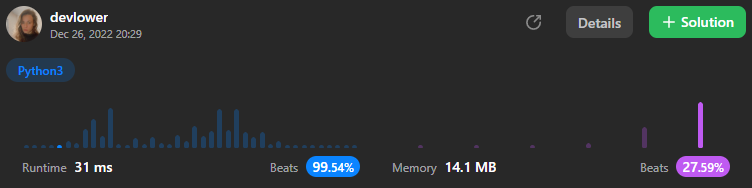

# Running Sum of 1d Array

#### Given an array `nums`. We define a running sum of an array as `runningSum[i] = sum(nums[0]…nums[i])`.

#### Return the running sum of `nums`.

### Example 1:
```
Input: nums = [1,2,3,4]
Output: [1,3,6,10]
Explanation: Running sum is obtained as follows: [1, 1+2, 1+2+3, 1+2+3+4].
```

### Example 2:
```
Input: nums = [1,1,1,1,1]
Output: [1,2,3,4,5]
Explanation: Running sum is obtained as follows: [1, 1+1, 1+1+1, 1+1+1+1, 1+1+1+1+1].
```

### Example 3:
```
Input: nums = [3,1,2,10,1]
Output: [3,4,6,16,17]
```

### Constraints:: 

- `1 <= nums.length <= 1000`
- `-10^6 <= nums[i] <= 10^6`

### Explanation:
#### The method begins by initializing an empty list called `result` and a variable called `running_sum` to `0`. It then iterates over the elements in `nums`, using a `for` loop. For each element in `nums`, the loop does the following:

- It adds the element to the `running_sum` variable.
- It appends the value of `running_sum` to the `result` list.

#### Finally, the `runningSum` method returns the `result` list.

#### Overall solution details:

<p align="center">
  
</p>

Solve this [Problem](https://leetcode.com/problems/running-sum-of-1d-array/) by yourself!<br>
Exercise your coding skills at [LeetCode](https://leetcode.com)!

<p align="center">
  
</p>
