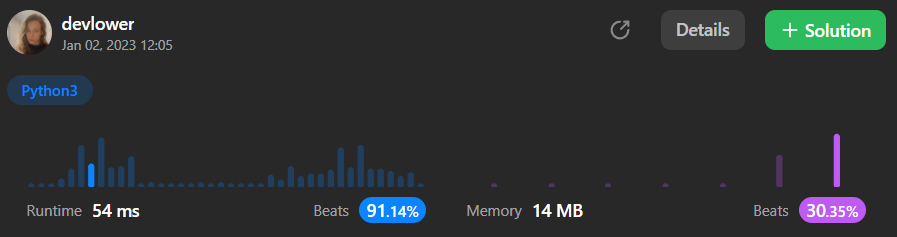

# Richest Customer Wealth

#### You are given an `m x n` integer grid `accounts` where `accounts[i][j]` is the amount of money the `ith` customer has in the `jth` bank. Return *the wealth that the richest customer has.*

#### A customer's wealth is the amount of money they have in all their bank accounts. The richest customer is the customer that has the maximum wealth.

### Example 1:

```
Input: accounts = [[1,2,3],[3,2,1]]
Output: 6
Explanation:
1st customer has wealth = 1 + 2 + 3 = 6
2nd customer has wealth = 3 + 2 + 1 = 6
Both customers are considered the richest with a wealth of 6 each, so return 6.
```

### Example 2:

```
Input: accounts = [[1,5],[7,3],[3,5]]
Output: 10
Explanation: 
1st customer has wealth = 6
2nd customer has wealth = 10 
3rd customer has wealth = 8
The 2nd customer is the richest with a wealth of 10.
```

### Example 3:

```
Input: accounts = [[2,8,7],[7,1,3],[1,9,5]]
Output: 17
```

### Constraints:: 

- `m == accounts.length`
- `n == accounts[i].length`
- `1 <= m, n <= 50`
- `1 <= accounts[i][j] <= 100`

### Solution explanation:
The `maximumWealth` method takes in a single argument, `accounts`, which is a list of lists of integers. The method returns an integer.

The method calculates the maximum sum of the elements in each row of `accounts`, and returns the maximum of these sums. It does this by using a generator expression to iterate over the rows of accounts, and for each row it calculates the sum of the elements in the row using the `sum` function. The `max` function then finds the maximum of these sums and returns it.

### Overall solution details:

<p align="center">
  
</p>

Try yourself to so solve this [Problem](https://leetcode.com/problems/richest-customer-wealth/)!
<br>
Exercise your coding skills at [LeetCode](https://leetcode.com)!

<p align="center">
  
</p>
