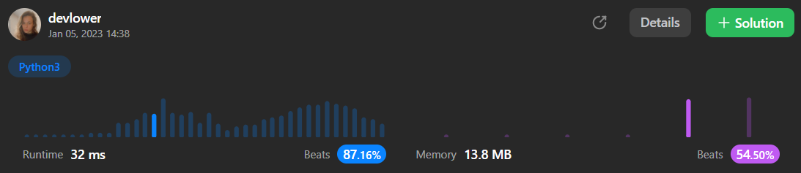

# Middle of the Linked List

#### Given the `head` of a singly linked list, return *the middle node of the linked list.*

#### If there are two middle nodes, return the second middle node.

### Example 1:

<p align="left">
  
</p>

```
Input: head = [1,2,3,4,5]
Output: [3,4,5]
Explanation: The middle node of the list is node 3.
```

### Example 2:

<p align="left">
  
</p>

```
Input: head = [1,2,3,4,5,6]
Output: [4,5,6]
Explanation: Since the list has two middle nodes with values 3 and 4, we return the second one.
```

### Constraints:: 

- The number of nodes in the list is in the range `[1, 100]`.
- `1 <= Node.val <= 100`

## Solution explanation:
The `middleNode` method takes in a singly linked list (represented by the `head` parameter) and returns the middle node of the list.

The function uses a "fast-slow" pointer approach to find the middle node in a single pass. The fast pointer moves two steps at a time, while the slow pointer moves one step at a time. When the fast pointer reaches the end of the list, the slow pointer will be at the middle node.

The function initializes the `slow` and `fast` pointers to the head of the list, and then enters a loop that runs as long as the `fast` pointer is not `None` and the `next` field of the `fast` pointer is not `None`. Inside the loop, the `slow` pointer is advanced by one node (`slow = slow.next`) and the fast pointer is advanced by two nodes (`fast = fast.next.next`).

After the loop exits, the function returns the `slow` pointer, which will be at the middle node of the list.

The time complexity of this solution is *O(n)*, where n is the number of nodes in the list. This is because the loop runs for at most n/2 iterations, and the rest of the operations (initializing the pointers and advancing them) are constant-time operations.

### Overall solution details:

<p align="center">
  
</p>

Try yourself to so solve this [Problem](https://leetcode.com/problems/middle-of-the-linked-list/)!
<br>
Exercise your coding skills at [LeetCode](https://leetcode.com)!

<p align="center">
  
</p>
