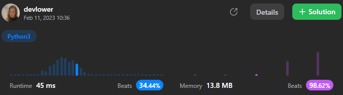

# Merge Two Sorted Lists

You are given the heads of two sorted linked lists `list1` and `list2`.

Merge the two lists in a one **sorted** list. The list should be made by splicing together the nodes of the first two lists.

Return _the head of the merged linked list_.

### Example 1:

```
Input: list1 = [1,2,4], list2 = [1,3,4]
Output: [1,1,2,3,4,4]
```

### Example 2:

```
Input: list1 = [], list2 = []
Output: []
```

### Example 3:

```
Input: list1 = [], list2 = [0]
Output: [0]
```

### Constraints:: 

- The number of nodes in both lists is in the range `[0, 50]`.
- `-100 <= Node.val <= 100`
- Both `list1` and `list2` are sorted in **non-decreasing** order.

## Solution explanation:

The method `mergeTwoLists` takes in two singly linked lists, `list1` and `list2`, and the output is a singly linked list that represents the sorted merge of the two input lists.

The code uses a dummy node, `mergedList`, to keep track of the head of the merged list. A while loop is used to iterate over the nodes of `list1` and `list2`, comparing their values and appending the node with the smaller value to the `mergedList`. After each iteration of the loop, the `dummy` node is updated to point to the `next` node of the `mergedList`.

Once one of the input lists is fully processed, the remaining nodes of the other list are appended to the `mergedList`. This is done by checking if either `list1` or `list2` is not `None`, and if this is the case, then the `next` field of the `dummy` node is set to the non-`None` list.

The dummy node is not included in the returned linked list, as only its `next` field, which represents the head of the merged list, is returned. The returned linked list consists of all the nodes in the `mergedList` except for the dummy node.

The time complexity of this code is O(n), where n is the total number of nodes in both input lists, and its space complexity is O(1), as the code does not require additional space for the creation of new nodes or for storing the result of the merge.

### Overall solution details:

<p align="center">
  
</p>

Try yourself to so solve this [Problem](https://leetcode.com/problems/merge-two-sorted-lists/)!
<br>
Exercise your coding skills at [LeetCode](https://leetcode.com)!

<p align="center">
  
</p>
