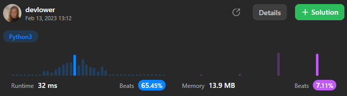

# Count Odd Numbers in an Interval Range

Given two non-negative integers `low` and `high`. Return the _count of odd numbers between `low` and `high` (inclusive)._

### Example 1:

```
Input: low = 3, high = 7
Output: 3
Explanation: The odd numbers between 3 and 7 are [3,5,7].
```

### Example 2:

```
Input: low = 8, high = 10
Output: 1
Explanation: The odd numbers between 8 and 10 are [9].
```

### Constraints:: 

- `0 <= low <= high <= 10^9`

## Solution explanation:

The method `countOdds` takes in two parameters: `low` and `high`, both of type `int`. The purpose of this method is to determine the number of odd integers within the range `low` to `high` (inclusive) and return the result as an integer.

The method starts by checking whether `low` is even or odd using the bitwise operator `&`. If `low & 1 == 0`, it means that `low` is even because the binary representation of `1` is `00000001` and the binary representation of an even number with the last bit as 0. So, when `low` is even and `low & 1` is performed, the result will be 0.

If `low` is even, then the method returns the number of odd integers in the range `low + 1` to `high + 1` with a step of 2 using the built-in function `len` and the function `range`. The reason for starting the range at `low + 1` instead of `low` is because `low` is even, so we want to exclude it from the count of odd numbers.

If `low` is odd, then the method returns the number of odd integers in the range `low` to `high + 1` with a step of 2. In this case, `low` is already an odd number, so there is no need to exclude it from the count.

### Overall solution details:

<p align="center">
  
</p>

Try yourself to so solve this [Problem](https://leetcode.com/problems/count-odd-numbers-in-an-interval-range/)!
<br>
Exercise your coding skills at [LeetCode](https://leetcode.com)!

<p align="center">
  
</p>
