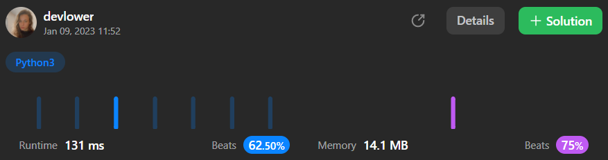

# Maximum Count of Positive Integer and Negative Integer

Given an array `nums` sorted in **non-decreasing** order, return *the maximum between the number of positive integers and the number of negative integers.*

- In other words, if the number of positive integers in `nums` is `pos` and the number of negative integers is `neg`, then return the maximum of `pos` and `neg`.

**Note** that `0` is neither positive nor negative.

### Example 1:

```
Input: nums = [-2,-1,-1,1,2,3]
Output: 3
Explanation: There are 3 positive integers and 3 negative integers. The maximum count among them is 3.
```

### Example 2:

```
Input: nums = [-3,-2,-1,0,0,1,2]
Output: 3
Explanation: There are 2 positive integers and 3 negative integers. The maximum count among them is 3.
```

### Example 3:

```
Input: nums = [5,20,66,1314]
Output: 4
Explanation: There are 4 positive integers and 0 negative integers. The maximum count among them is 4.
```

### Constraints:: 

- `1 <= nums.length <= 2000`
- `-2000 <= nums[i] <= 2000`
- `nums` is sorted in a **non-decreasing order**.

## Solution explanation:
The method `maximumCount` takes in a single argument, `nums`, which is a list of integers. The function returns an integer representing the maximum number of elements in `nums` that are either positive or negative.

The function first initializes two variables, `countNeg` and `countPos`, to 0. These variables will be used to count the number of negative and positive elements in `nums`, respectively.

The function then iterates through the elements of `nums` using a `for` loop. For each element, `num`, the function checks if `num` is negative. If it is, it increments `countNeg` by 1. If `num` is not negative, the function checks if it is positive. If it is, it increments `countPos` by 1.

After the loop finishes, the function compares `countNeg` and `countPos` and returns the larger of the two values. If `countNeg` is greater than `countPos`, the function returns `countNeg`. Otherwise, it returns `countPos`.

### Overall solution details:

<p align="center">
  
</p>

Try yourself to so solve this [Problem](https://leetcode.com/contest/weekly-contest-327/problems/maximum-count-of-positive-integer-and-negative-integer/)!
<br>
Exercise your coding skills at [LeetCode](https://leetcode.com)!

<p align="center">
  
</p>
