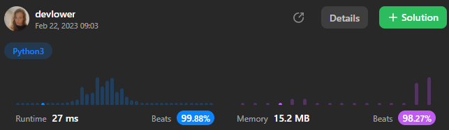

# Maximum Depth of Binary Tree

Given the `root` of a binary tree, return _its maximum depth_.

A binary tree's **maximum depth** is the number of nodes along the longest path from the root node down to the farthest leaf node.

### Example 1:


```
Input: root = [3,9,20,null,null,15,7]
Output: 3
```

### Example 2:

```
Input: root = [1,null,2]
Output: 2
```

### Constraints:: 

- The number of nodes in the tree is in the range `[0, 10^4]`.
- `-100 <= Node.val <= 100`

## Solution explanation:

This code finds the maximum depth of a binary tree using a [Breadth-First Search (BFS)](https://en.wikipedia.org/wiki/Breadth-first_search) algorithm. It begins by importing the [`deque`](https://docs.python.org/3/library/collections.html#collections.deque) class from the [`collections`](https://docs.python.org/3/library/collections.html) module to create a queue.

The `maxDepth` method takes a `root` node as input, which is an instance of the `TreeNode` class representing the root of the binary tree.

First, it checks if the root is `None`. If it is, the tree is empty, so the function returns 0.

If the root is not `None`, it initializes the `depth` variable to 0 and creates a queue `deque` with the root node.

The code then enters a `while` loop that continues as long as there are nodes in the queue. The loop is used to traverse the binary tree level-by-level, beginning at the root and moving down to the leaf nodes.

In each iteration of the `while` loop, it increments the `depth` variable by 1, since it has moved down one level. It then uses a `for` loop to process all the nodes in the current level.

The `for` loop goes through all the nodes in the current level, and adds their children (if any) to the queue. To do this, it uses the `popleft()` method to remove the next node from the front of the queue and assign it to the `node` variable. This ensures that the BFS algorithm processes the nodes level-by-level, starting with the root node and moving down to the leaf nodes.

If a node has a left child, it adds it to the queue using the `append()` method, and if it has a right child, it also adds it to the queue.

At the end of each iteration of the `while` loop, it has processed all the nodes in the current level and has added their children (if any) to the queue. It repeats this process until there are no more nodes in the queue.

At this point, it has processed all the nodes in the tree, and the `depth` variable contains the maximum depth of the tree. The function returns the `depth` variable as the result of the `maxDepth` method.

The advantage of using BFS over [Depth-First Search (DFS)](https://en.wikipedia.org/wiki/Depth-first_search#:~:text=Depth-first%20search%20(DFS),along%20each%20branch%20before%20backtracking.) is that BFS processes the nodes level-by-level, which means it can give us the depth of the tree without having to traverse the entire tree. Additionally, BFS can be more efficient than DFS for large trees, since it uses a queue to keep track of the nodes to visit.

### Overall solution details:

 <p align="center">
    
</p>

Try yourself to so solve this [Problem](https://leetcode.com/problems/maximum-depth-of-binary-tree/)!
<br>
Exercise your coding skills at [LeetCode](https://leetcode.com)!

## References

- [Breadth-First Search (BFS)](https://en.wikipedia.org/wiki/Breadth-first_search)
- [Collections Library](https://docs.python.org/3/library/collections.html)
  - [Deque](https://docs.python.org/3/library/collections.html#collections.deque)
- [Depth-First Search (DFS)](https://en.wikipedia.org/wiki/Depth-first_search#:~:text=Depth-first%20search%20(DFS),along%20each%20branch%20before%20backtracking.)

<p align="center">
  
</p>
