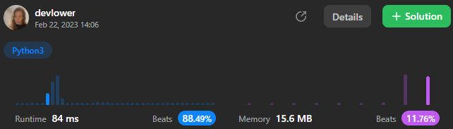

# Remove Duplicates from Sorted Array

Given an integer array `nums` sorted in non-decreasing order, remove the duplicates [in-place](https://en.wikipedia.org/wiki/In-place_algorithm) such that each unique element appears only **once**. The **relative order** of the elements should be kept the **same**.

Since it is impossible to change the length of the array in some languages, you must instead have the result be placed in the first part of the array `nums`. More formally, if there are `k` elements after removing the duplicates, then the first k elements of `nums` should hold the final result. It does not matter what you leave beyond the first `k` elements.

Return `k` _after placing the final result in the first `k` slots of `nums`_.

Do **not** allocate extra space for another array. You must do this by **modifying the input array in-place** with O(1) extra memory.

**Custom Judge:**

The judge will test your solution with the following code:

```
int[] nums = [...]; // Input array
int[] expectedNums = [...]; // The expected answer with correct length

int k = removeDuplicates(nums); // Calls your implementation

assert k == expectedNums.length;
for (int i = 0; i < k; i++) {
    assert nums[i] == expectedNums[i];
}
```

If all assertions pass, then your solution will be **accepted**.

### Example 1:

```
Input: nums = [1,1,2]
Output: 2, nums = [1,2,_]
Explanation: Your function should return k = 2, with the first two elements of nums being 1 and 2 respectively.
It does not matter what you leave beyond the returned k (hence they are underscores).
```

### Example 2:

```
Input: nums = [0,0,1,1,1,2,2,3,3,4]
Output: 5, nums = [0,1,2,3,4,_,_,_,_,_]
Explanation: Your function should return k = 5, with the first five elements of nums being 0, 1, 2, 3, and 4 respectively.
It does not matter what you leave beyond the returned k (hence they are underscores).
```

### Constraints:

- `1 <= nums.length <= 3 * 10^4]`.
- `-100 <= nums[i] <= 100`
- `nums` is sorted in **non-decreasing** order.

## Solution explanation:

The method `removeDuplicates` takes a list of integers `nums` as a parameter and return the `length` of the initial list without the duplicates numbers. The method starts with a simple check to see if the list is empty. If the length of `nums` is zero, it means there are no duplicates, and the method simply returns 0. Otherwise, it sets the variable `i` to 0, which will serve as the index for the new, non-duplicate list.

The method then enters a loop that starts at index 1 and iterates over the entire list using the `range` function. For each index `j` in the loop, the method checks if the value at index `j` is different from the value at index `i`. If it is, it means that this is a new value that hasn't been added to the non-duplicate list yet.

In that case, the method increments `i` by 1 to indicate that a new value has been found, and sets the value at index `i` to the value at index `j`. This effectively `moves` the new value to the end of the non-duplicate list.

After the loop completes, the method returns `i + 1`, which represents the length of the non-duplicate list. Since `i` was the last index of the non-duplicate list, adding 1 gives us the length of the list.

Overall, this method uses a simple two-pointer approach to remove duplicates in linear time, meaning it scales well even for very large input lists.

### Overall solution details:

 <p align="center">
    
</p>

Try yourself to so solve this [Problem](https://leetcode.com/problems/remove-duplicates-from-sorted-array/)!
<br>
Exercise your coding skills at [LeetCode](https://leetcode.com)!

<p align="center">
  
</p>
