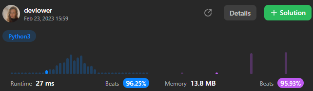

# Remove Element

Given an integer array `nums` and an integer `val`, remove all occurrences of `val` in `nums` [in-place](https://en.wikipedia.org/wiki/In-place_algorithm.). The relative order of the elements may be changed.

Since it is impossible to change the length of the array in some languages, you must instead have the result be placed in the first part of the array `nums`. More formally, if there are `k` elements after removing the duplicates, then the first k elements of `nums` should hold the final result. It does not matter what you leave beyond the first `k` elements.

Return `k` _after placing the final result in the first `k` slots of `nums`_.

Do **not** allocate extra space for another array. You must do this by **modifying the input array in-place** with O(1) extra memory.

**Custom Judge:**

The judge will test your solution with the following code:

```
int[] nums = [...]; // Input array
int val = ...; // Value to remove
int[] expectedNums = [...]; // The expected answer with correct length.
                            // It is sorted with no values equaling val.

int k = removeElement(nums, val); // Calls your implementation

assert k == expectedNums.length;
sort(nums, 0, k); // Sort the first k elements of nums
for (int i = 0; i < actualLength; i++) {
    assert nums[i] == expectedNums[i];
}
```

If all assertions pass, then your solution will be **accepted**.

### Example 1:

```
Input: nums = [3,2,2,3], val = 3
Output: 2, nums = [2,2,_,_]
Explanation: Your function should return k = 2, with the first two elements of nums being 2.
It does not matter what you leave beyond the returned k (hence they are underscores).
```

### Example 2:

```
Input: nums = [0,1,2,2,3,0,4,2], val = 2
Output: 5, nums = [0,1,4,0,3,_,_,_]
Explanation: Your function should return k = 5, with the first five elements of nums containing 0, 0, 1, 3, and 4.
Note that the five elements can be returned in any order.
It does not matter what you leave beyond the returned k (hence they are underscores).
```

### Constraints:

- `0 <= nums.length <= 100`.
- `0 <= nums[i] <= 50`
- `0 <= val <= 100`

## Solution explanation:

The method `removeElement` takes a list of integers `nums` and an integer `val` as a parameters and return the `length` of the initial list without the `val` elements in the original list. The purpose of this method is to remove all instances of a given integer value, `val`, from a list of integers, `nums`. The method returns the new length of the list after the removals have been made.

Let's break down how the method works. The first line of the method initializes two variables: `i` and `n`. `i` is set to 0, and `n` is set to the length of the `nums` list. `i` will be used as an index for iterating through the list, and `n` will be used to keep track of the number of elements in the list as elements are removed.

The method then enters a while loop that will continue as long as `i` is less than `n`. This loop iterates through the `nums` list and checks each element to see if it is equal to `val`. If the element is equal to `val`, it is removed by swapping it with the last element in the list (which is at index `n-1`) and decrementing `n` by 1. If the element is not equal to `val`, `i` is incremented by 1 to move to the next element in the list.

Once the loop has finished iterating through the entire list, the method returns the new length of the list, which is the value of `n`. The length of the list has been updated to reflect the removal of all instances of the given integer value, `val`.

Overall, this method uses a two-pointer approach to remove elements from a list in place, without creating a new list. It is an efficient solution that runs in O(n) time, where `n` is the length of the list.

### Overall solution details:

 <p align="center">
    
</p>

Try yourself to so solve this [Problem](https://leetcode.com/problems/remove-element/)!
<br>
Exercise your coding skills at [LeetCode](https://leetcode.com)!

<p align="center">
  
</p>
