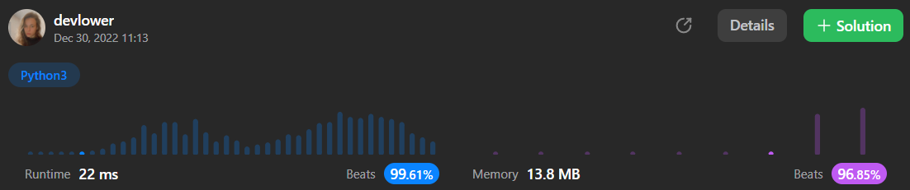

# Invert Binary Tree

#### You are given the `root` of a binary tree that consists of exactly `3`nodes: the root, its left child, and its right child.

#### Given the `root` of a binary tree, invert the tree, and return its root.

### Example 1:

<p align="left">
  
</p>

```
Input: root = [4,2,7,1,3,6,9]
Output: [4,7,2,9,6,3,1]
```

### Example 2:

<p align="left">
  
</p>

```
Input: root = [2,1,3]
Output: [2,3,1]
```

### Example 3:

```
Input: root = []
Output: []
```

### Constraints:: 

- The number of nodes in the tree is in the range `[0, 100]`.
- `-100 <= Node.val <= 100`

### Solution explanation:
The `invertTree` method takes as input a binary tree node called `root`, which is defined using the `TreeNode` class. The `TreeNode` class has three attributes: `val`, `left`, and `right`. These attributes represent the value of the node, the left child of the node, and the right child of the node, respectively.

The `invertTree` method inverts a binary tree by swapping the left and right children of each node in the tree. It does this by calling itself recursively on the left and right children of the current node. The base case of the recursion is when the input node (`root`) is `None`, in which case the function simply returns `None`.

Finally, the inverted tree is returned by the function.

### Overall solution details:

<p align="center">
  
</p>

Try yourself to so solve this [Problem](https://leetcode.com/problems/invert-binary-tree/)!
<br>
Exercise your coding skills at [LeetCode](https://leetcode.com)!

<p align="center">
  
</p>
